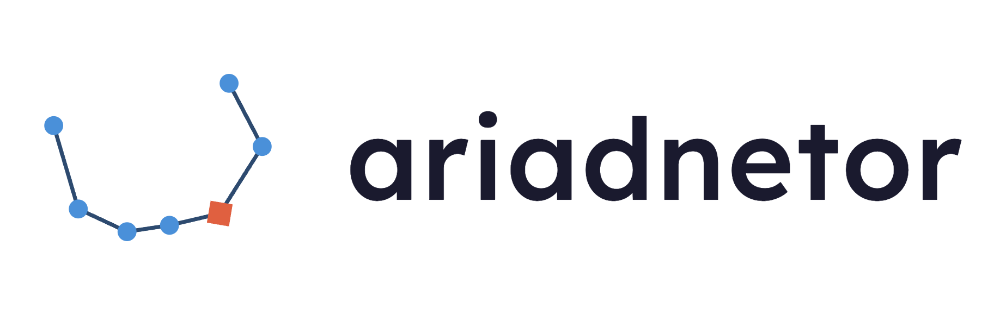
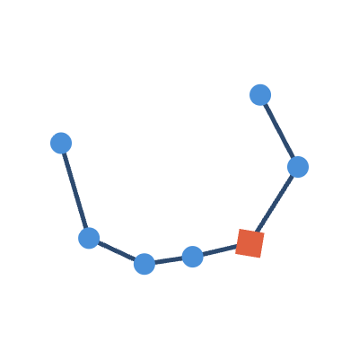

# Corona Borealis mark

<picture>
  <source media="(prefers-color-scheme: dark)" srcset="corona_lockup_dark.png">
  
</picture>

The ariadnetor logo: the constellation Corona Borealis as a node-and-edge graph,
its brightest star Alphecca picked out in red.



The icon is transparent, so one file works on both light and dark backgrounds;
the lockup ships as a light/dark pair (above) since only the wordmark colour
needs to invert.

## Generate

```
python gen_corona.py            # square icon
python gen_corona.py --wordmark # + "ariadnetor" lockup
python gen_corona.py --png      # also export PNG (headless Chrome)
```

## Star data

The seven nodes sit at the crown stars' real J2000 positions, so the arc is
irregular, not a clean circle. Coordinates come from the English Wikipedia
[List of stars in Corona Borealis][stars] (from SIMBAD / Hipparcos); see `STARS`
in `gen_corona.py`.

[stars]: https://en.wikipedia.org/wiki/List_of_stars_in_Corona_Borealis

## Palette

| role              | hex       |
|-------------------|-----------|
| background        | `#1a1a2e` |
| node              | `#4a90d9` |
| edge              | `#2d4a6f` |
| accent (Alphecca) | `#e06040` |
| wordmark          | `#ffffff` |
